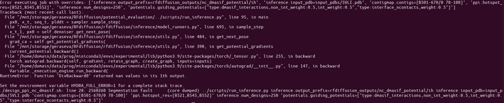

# Auxiliary potential

This is a repo containing tests of a complex DL auxiliary potential for RFdiffusion. 

## Installation

```
git clone https://github.com/geraseva/auxiliary_potential
cd auxiliary_potential

# clone submodules, or simply make a symlink if you already have some of them
git clone https://github.com/geraseva/masif_martini
git clone https://github.com/geraseva/RFdiffusion
git clone https://github.com/dauparas/LigandMPNN

# get RFdiffusion weights
cd RFdiffusion
mkdir models && cd models
wget http://files.ipd.uw.edu/pub/RFdiffusion/6f5902ac237024bdd0c176cb93063dc4/Base_ckpt.pt
wget http://files.ipd.uw.edu/pub/RFdiffusion/e29311f6f1bf1af907f9ef9f44b8328b/Complex_base_ckpt.pt
wget http://files.ipd.uw.edu/pub/RFdiffusion/60f09a193fb5e5ccdc4980417708dbab/Complex_Fold_base_ckpt.pt

# get LigandMPNN weights
cd ../LigandMPNN
bash get_model_params.sh "./model_params"
```
Create conda environment for running RFdiffusion with auxiliary potentials
```
cd ../RFdiffusion
conda env create -f env/SE3nv.yml

conda activate SE3nv
cd env/SE3Transformer
pip install --no-cache-dir -r requirements.txt
python setup.py install
cd ../.. # change into the root directory of the repository
pip install -e . # install the rfdiffusion module from the root of the repository

cd ../LigandMPNN # install LigandMPNN requirements
pip install -r requirements.txt
```
## Tests

Test scripts are located in ```potential_validation``` folder

## For collaborators

I have some random errors when running my auxiliary potential like this:
```
cd potential_validation
conda activate SE3env
../RFdiffusion/scripts/run_inference.py inference.num_designs=50 \
  inference.output_prefix=rfdiffusion_outputs/example \
  inference.input_pdb=input_pdbs/4ZXB.pdb ppi.hotspot_res=[E58,E88,E96] \
  'contigmap.contigs=[E1-150/0 70-100]' \
  'potentials.guiding_potentials=["type:dmasif_interactions,non_int_weight:0.5,int_weight:0.5"]'
```
About after an hour of computation it randomly raises an error like this: 


